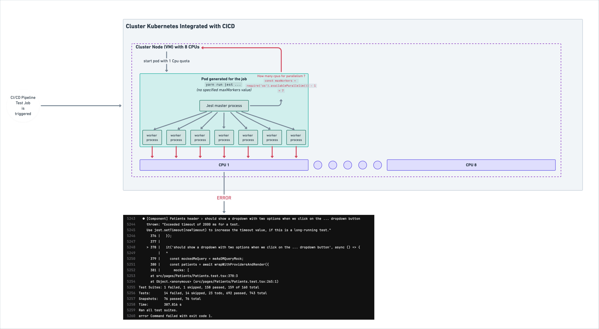
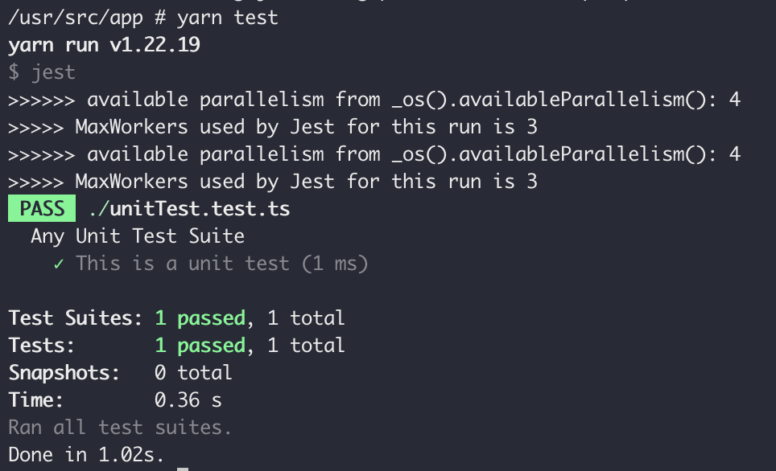

# Node bug - os.availableParallism() -> does not take cpu limits into account



## Root Cause of the bug :

- Jest uses `require("os").availableParallelism()` to count the available CPUs ([see here](https://github.com/jestjs/jest/blob/c9767a9ce8d2d321254d40dc8187ab348533fe6e/packages/jest-config/src/getMaxWorkers.ts#L10)). But in a containerized environment, it does not take the cpu limit into account
- This [Node method](https://nodejs.org/api/os.html#osavailableparallelism) is a wrapper around [libuv/uv_available_parallism](https://github.com/libuv/libuv/blob/c811169f91b2101f7302e96de3d2dc366ade3a25/src/unix/core.c#L1743)
- It does not take into account the actual information of cpu limit, which is usually written in `/sys/fs/cgroup/cpu.max` inside the linux-images containers

## Ideas of solutions

### [Short term] Set a static value of parallelism corresponding to your infrastructure

For a short term fix, when using jest, set the `--maxWorkers` option to a value corresponding to the number of Cpus available for your process (minus 1). (However, in lacks elasticity so when you will change the capacity of your container, you will have to change this setting too)

### [Best] Fix the root cause by improving [libuv/uv_available_parallism](https://github.com/libuv/libuv/blob/c811169f91b2101f7302e96de3d2dc366ade3a25/src/unix/core.c#L1743)

Such utilitary node function is crucial in a time where containerized runtime has become very common.
I have not found any alternative close to get the available Cpus for a node process, taking into account resource limits/quota so far.

We can add an early condition that first, looks for cpu informations in `/sys/fs/cgroup/cpu.cfs_quota_us` and `/sys/fs/cgroup/cpu.cfs_period_us` for [linux kernel using cgroup v1](https://docs.kernel.org/scheduler/sched-bwc.html), or in `/sys/fs/cgroup/cpu.max` for [linux kernel using cgroup v2](https://docs.kernel.org/admin-guide/cgroup-v2.html#cgroup-v2-cpu). If they contain quantified limits, do the ratio to compute available parallelism. Else, continue with existing behavior.

### [Less durable] Patch jest [getNumCpus()](https://github.com/jestjs/jest/blob/c9767a9ce8d2d321254d40dc8187ab348533fe6e/packages/jest-config/src/getMaxWorkers.ts#L10)

We can use the same early condition. (However this behavior truly has its place in a Node support library, this use case should interest other libraries)

## Reproduce the bug in local with Docker Compose:

#### Requirements:

- [Docker (v>4.0) server](https://docs.docker.com/get-docker/) installed
- [Yarn](https://v3.yarnpkg.com/getting-started/install) installed

#### Install the dependencies (merely jest) : `yarn install`

#### Open the source code and add logs in the file [node_modules/jest-config/build/getMaxWorkers.js](node_modules/jest-config/build/getMaxWorkers.js) file with the following content :

```js
// node_modules/jest-config/build/getMaxWorkers.js

"use strict";

Object.defineProperty(exports, "__esModule", {
  value: true,
});
exports.default = getMaxWorkers;
function _os() {
  const data = require("os");
  _os = function () {
    return data;
  };
  return data;
}
/**
 * Copyright (c) Meta Platforms, Inc. and affiliates.
 *
 * This source code is licensed under the MIT license found in the
 * LICENSE file in the root directory of this source tree.
 */

function getNumCpus() {
  if (typeof _os().availableParallelism === "function") {
    const availableParallelism = (0, _os().availableParallelism)();
    console.log(
      `>>>>>> available parallelism from _os().availableParallelism(): ${availableParallelism}`
    );
    return availableParallelism;
  }
  const availableParallelism = (0, _os().cpus)()?.length ?? 1;
  console.log(
    `>>>>>> available parallelism from _os().cpus()?.length: ${availableParallelism}`
  );
  return availableParallelism;
}
function getMaxWorkers(argv, defaultOptions) {
  let maxWorkers = 1;
  if (argv.runInBand) {
    maxWorkers = 1;
  } else if (argv.maxWorkers) {
    maxWorkers = parseWorkers(argv.maxWorkers);
  } else if (defaultOptions && defaultOptions.maxWorkers) {
    maxWorkers = parseWorkers(defaultOptions.maxWorkers);
  } else {
    // In watch mode, Jest should be unobtrusive and not use all available CPUs.
    const numCpus = getNumCpus();
    const isWatchModeEnabled = argv.watch || argv.watchAll;
    maxWorkers = Math.max(
      isWatchModeEnabled ? Math.floor(numCpus / 2) : numCpus - 1,
      1
    );
  }
  console.log(`>>>>> MaxWorkers used by Jest for this run is ${maxWorkers}`);
}
const parseWorkers = (maxWorkers) => {
  const parsed = parseInt(maxWorkers.toString(), 10);
  if (
    typeof maxWorkers === "string" &&
    maxWorkers.trim().endsWith("%") &&
    parsed > 0 &&
    parsed <= 100
  ) {
    const numCpus = getNumCpus();
    const workers = Math.floor((parsed / 100) * numCpus);
    return Math.max(workers, 1);
  }
  return parsed > 0 ? parsed : 1;
};
```

#### Build the linux + node image `docker compose build --no-cache`

#### Set a cpu limit on your container execution with docker compose :

```yaml
// In compose.yaml:
services:
  server:
    build:
      context: .
    environment:
      NODE_ENV: production
    deploy:
      resources:
        limits:
          cpus: "2.50" # Here set whatever value you want (preferably not a remarquable number)
    volumes:
      - ./:/usr/src/app
      - ./node_modules/:/usr/src/app/node_modules/
    ports:
      - 5555:5555
    command: tail -f /dev/null
```

#### Start the image in a container `docker compose up -d`

#### Open a terminal shell in the container `docker exec -it bug-jest-wrong-parallelism-with-cpu-quota-server-1 /bin/sh`

#### Execute the test with the modified logs `yarn test`

(jest uses all the available CPUs available to the docker server, whatever limit you set !)


#### Checkout that the cpu limit info is available in the container file system : `cat /sys/fs/cgroup/cpu.max`


